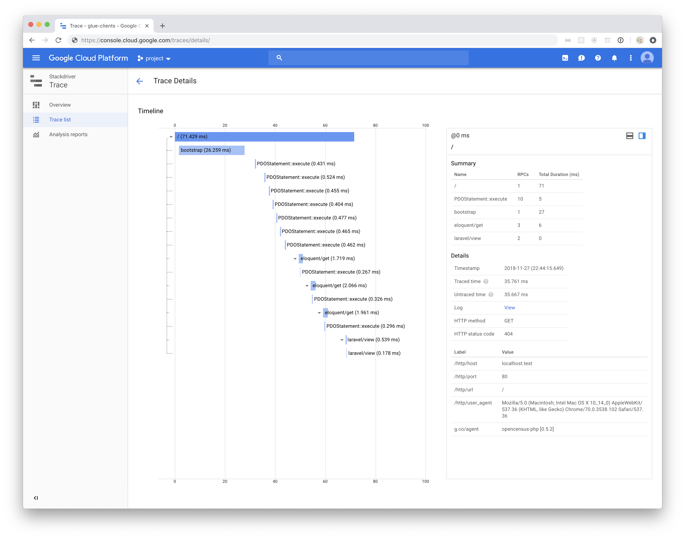
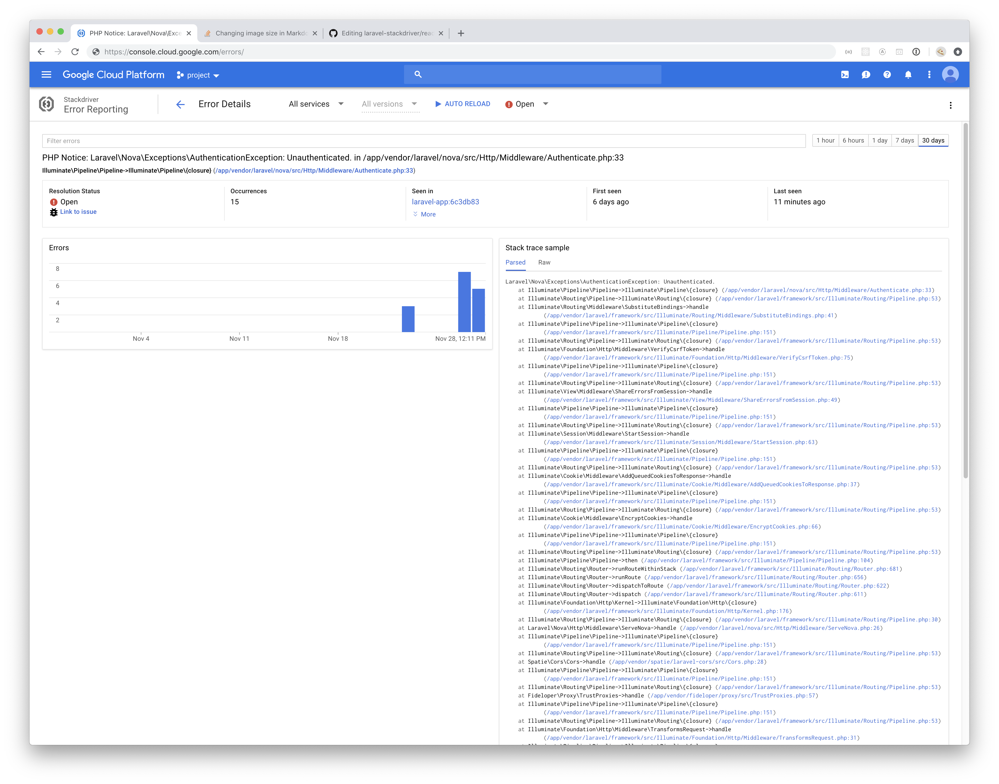

# Laravel Stackdriver

[![Latest Version on Packagist][ico-version]][link-packagist]
[![Total Downloads][ico-downloads]][link-downloads]

Enables logging, tracing and error reporting to Google Stackdriver for Laravel.
Requires PHP >= 7.1

## Screenshots
 

## Installation

Via Composer

``` bash
composer require gluedev/laravel-stackdriver
```

And publish the config file

``` bash
php artisan vendor:publish --provider="GlueDev\Laravel\Stackdriver\StackdriverServiceProvider"
```

## Usage

First, you will want to open `config/stackdriver.php`. Here you can see that you have four environment settings available to enable and disable the different features of this package:

``` bash
STACKDRIVER_ENABLED=false  
STACKDRIVER_LOGGING_ENABLED=true  
STACKDRIVER_TRACING_ENABLED=true
STACKDRIVER_ERROR_REPORTING_ENABLED=true
```

The first variable listed has priority over the others.

### Authentication
At the time of writing, Google prefers you to authenticate using a service account. It will throw a warning otherwise, which you can (but probably should not) disable by setting `SUPPRESS_GCLOUD_CREDS_WARNING=true`

Create a service account with the appropriate roles attached to it and add it to your project. Make sure not to commit this file to git, because of security. You can then specify the path to the service account JSON file in the `keyFilePath` or in the `STACKDRIVER_KEY_FILE_PATH` environment variable.

### Tracing
Tracing requires the OpenCencus module to be installed. As we use docker, this is how we install it:

``` Dockerfile
RUN pecl install opencensus-alpha
RUN docker-php-ext-enable opencensus
``` 

**Please note**: If you run in to an `opencensus.so: undefined symbol: ZVAL_DESTRUCTOR` error after installing the OpenCencus extension, it is recommended to build the extension yourself, following [these instructions](https://github.com/GlueDev/laravel-stackdriver/issues/6#issuecomment-584157568).

### Logging
Other than changing the values in the config file, logging needs no additional setup.

### Error reporting
Error reporting requires you to add the following to the `report` function in your `Exceptions/handler.php` 

``` php
use GlueDev\Laravel\Stackdriver\StackdriverExceptionHandler;

/**  
 * Report or log an exception.
 *
 * @param \Exception  $exception  
 * @return void  
 */
public function report(Exception $exception)  
{  
    StackdriverExceptionHandler::report($exception);  
    parent::report($exception);  
}
```

Log in to Google Cloud Console and you should start seeing logs, traces and errors appear.

### Batch daemon
Google also provides a batch daemon, which is recommended to use. We have seen issues with slow time to first byte on requests when the daemon was not running. 
The easiest way to run the daemon is using Supervisor. An example configuration for you to edit:

```bash
[program:google-batch-daemon]
command = php -d auto_prepend_file='' -d disable_functions='' /app/vendor/bin/google-cloud-batch daemon
process_name = %(program_name)s
user = application
numprocs = 1
autostart = true
autorestart = true
stdout_logfile = /dev/stdout
stdout_logfile_maxbytes = 0
stderr_logfile = /dev/stderr
stderr_logfile_maxbytes = 0
```

You also need to tell Google that the daemon is running. This is done by setting the `IS_BATCH_DAEMON_RUNNING=true`.

And that is it!

## Change log

Please see the [changelog](CHANGELOG.md) for more information on what has changed recently.

## Credits

- [Diederik van den Burger][link-author]
- [All Contributors][link-contributors]

## License

Please see the [license file](LICENSE.md) for more information.

[ico-version]: https://img.shields.io/packagist/v/gluedev/laravel-stackdriver.svg?style=flat-square
[ico-downloads]: https://img.shields.io/packagist/dt/gluedev/laravel-stackdriver.svg?style=flat-square

[link-packagist]: https://packagist.org/packages/gluedev/laravel-stackdriver
[link-downloads]: https://packagist.org/packages/gluedev/laravel-stackdriver
[link-author]: https://github.com/diederikvandenb
[link-contributors]: ../../contributors]
